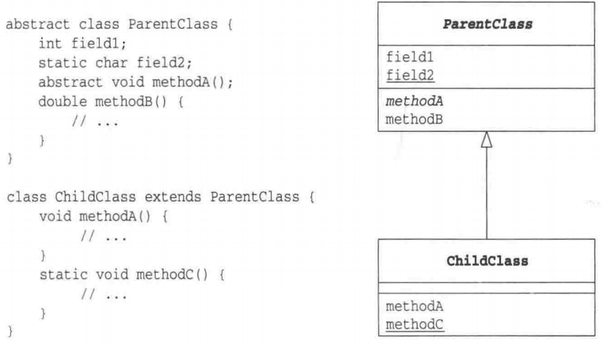
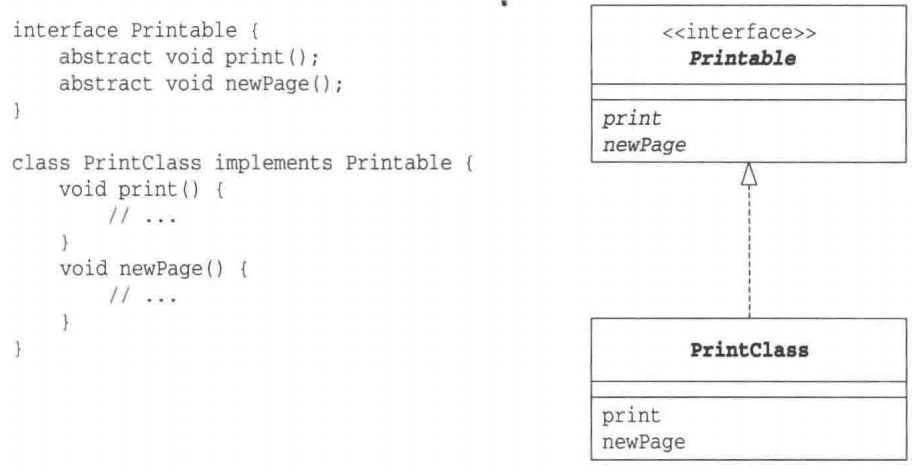
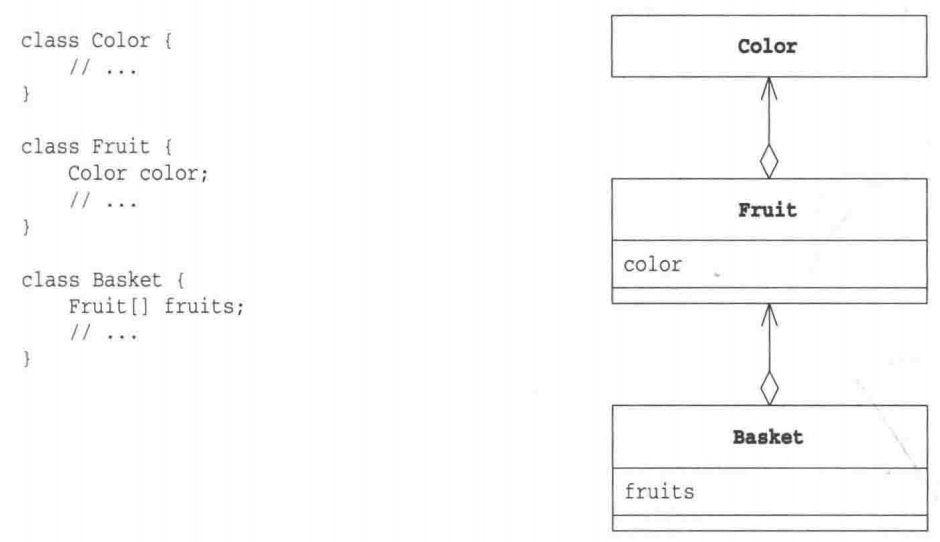

# my-design-pattern

《图解设计模式》笔记

### 类图

- 继承
 
    

- 实现

    
    
 - 聚合
 
       

### 目录

适应设计模式
- Iterator模式---一个一个遍历
- Adapter模式---加个"适配器"以便于复用

交给子类
- Template Method模式---将具体处理交给子类
- Fectory Method模式---将实例的生成交给子类

生成实例
- Singleton模式---只有一个实例
- Prototype模式---通过复制生成实例
- Builder模式---组装复杂的实例
- Abstract Factory模式---将关联零件组装成产品

分开考虑
- Bridge模式---将类的功能层次结构与实现层次结构分离
- strategy模式---整体地替换算法

一致性
- Composite模式---容器与内容的一致性
- Decorator模式---装饰边框与被装饰物的一致性

访问数据结构
- Visitor模式---访问数据结构并处理数据
- Chain of Responsibility模式---推卸责任

简单化
- Facade模式---简单窗口
- Mediator模式---只有一个仲裁者

管理状态
- Observer模式---发送状态变化通知
- Memento模式---保存对象状态
- State模式---用类表示状态

避免浪费
- Flyweight模式---共享对象，避免浪费
- Proxy模式---只在必要时生成实例

用类来表现
- Command模式---命令也是类
- Interpreter模式---语法规则也是类