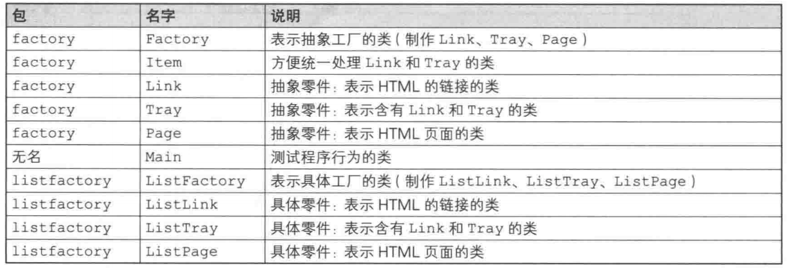
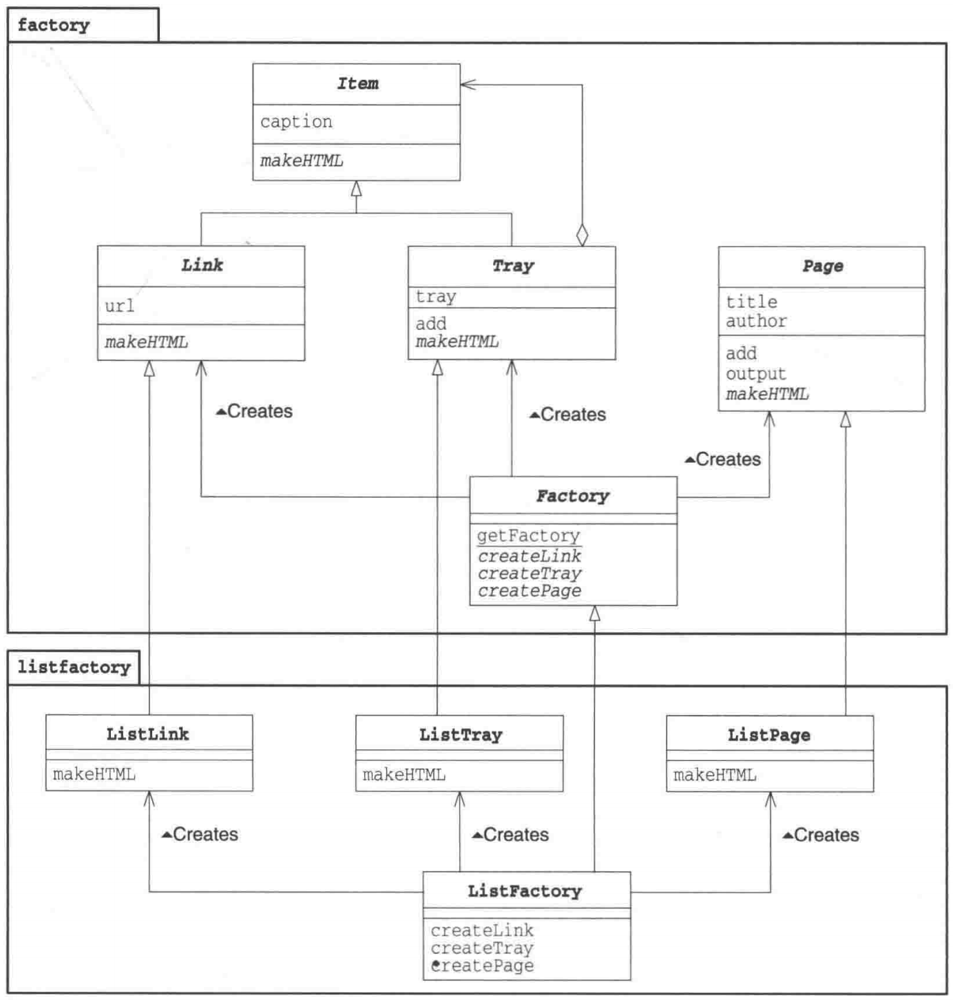
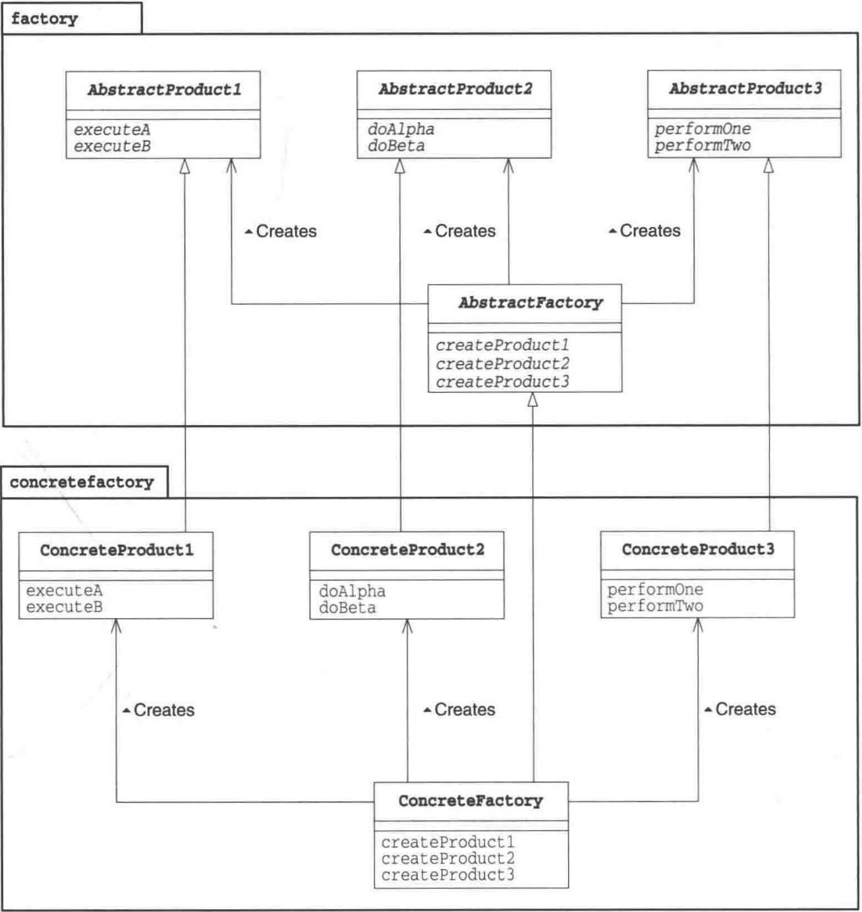

# Abstract Factory 模式

### 定义
- 抽象工厂的工作是将"抽象零件"组装为"抽象产品"

### 类图

### 角色

### 实现
- factory包：AbstractProduct类、AbstractFactory类
- concretefactory包：ConcreteProduct类、ConcreteFactory类
- factory是抽象类
- 静态方法getFactory是通过反射Class.forName(classname).newInstance()方式

### 说明
- 易于增加具体工厂，且无需修改抽象工厂和Main
- 难以增加新的零件，因必须修改所有具体工厂

