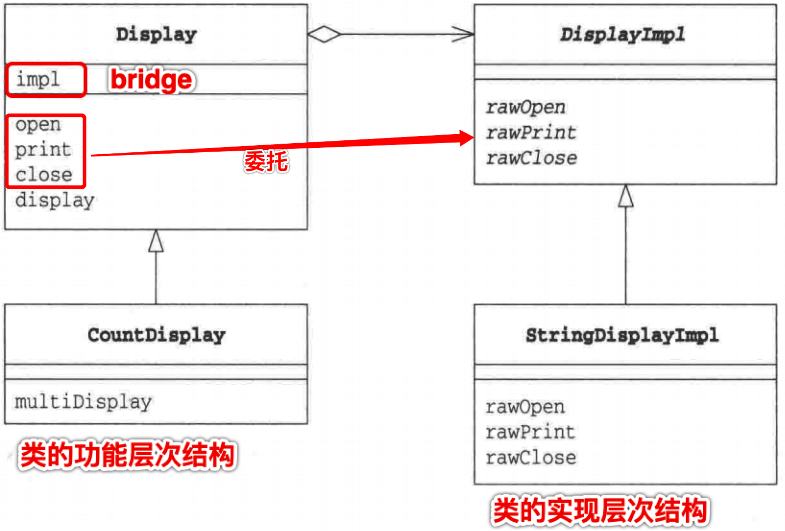
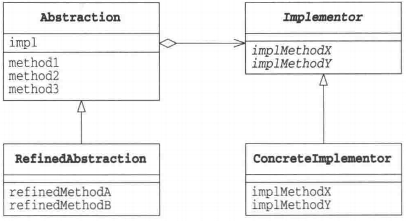

# Bridge 模式

### 定义
1. 在"类的功能层次结构"和"类的实现层次结构"间搭建桥梁
2. 类的层次结构
    - 希望增加新功能时---创建子类在父类中有基本功能在子类中添加新功能（增加新方法），叫类的功能层次结构
    - 希望增加新实现时---子类实现父类的抽象方法（不增加新方法），叫类的实现层次结构
3. 因此编写子类时要先明确："我是要增加功能"还是"要增加实现"
4. 当类的层次结构只有一层时，功能层次结构与实现层次结构混杂在一起，难以透彻理解类的层次结构，因此需要分开

### 示例类图

### 角色

### 实现
- 类的功能层次结构
    - Abstraction: 类的功能层次结构 的最上层，保存了Implementor角色的实例
    - RefinedAbstraction: 在Abstraction基础上增加了新功能
- 类的实现层次结构
    - Implementor: 累的实现层次结构 的最上层，定义实现Abstraction类的接口
    - ConcreteImplementor: 具体实现Implementor接口
- 二者之间的桥梁是impl

### 说明
- Bridge模式将"类的功能层次结构"和"类的实现层次结构"分开，有利于对他们独立地进行扩展
- 想要增加功能时，只需在"类的功能层次结构"一侧增加，且增加功能后可以被所有实现使用
- 继承是强关联，委托是弱关联
- 如过想要轻松改变类之间的关系，继承不合适，应该用委托
- 示例中其他类要求Display类工作时，Display类并非自己工作，而是将工作交给impl