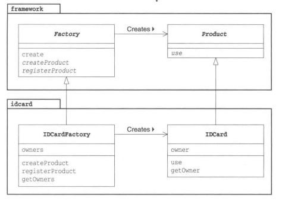
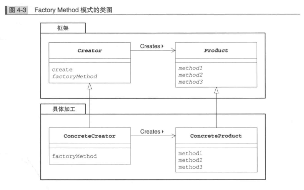

# Factory Method 模式

### 定义
- 用Template Method模式构建生成实例的工厂
- 父类决定实例的生成方式，但不决定所要生成的具体类，具体的处理全部交给子类负责，起到解耦的作用

### 类图


### 角色


### 实现
- framework包：Product类、Factory类
- idcard包：IDCard类、IDCardFactory类

### 说明
- 只要Factory Method模式，在生成实例时就一定会使用到Template Method模式	
- 不用new生成实例，而用专用的方法来生成实例，可防止父类与其他类耦合
- 在新定义TelevisonFactory时，我们只要import framework包就可以编写televison包，不用修改framework包的内容
- 在framework包中的类中并没有出现具体类的名字，称作framework包不依赖于idcard包

### 生成实例的三种方式
- 指定为抽象方法

```
//子类必须实现该方法，不然编译报错
public abstract class Factory {
	protected abstract Product createProduct(String owner);
}

```

- 为其实现默认处理

```
//如果子类没实现该方法，则执行默认行为
class Factory {
	public Product createProduct(String owner) {
		//注意这里使用new，因此不能将Product定义为抽象类
		return new Product(owner);
	}
}

```

- 在其中抛出异常

```
class Factory {
	public Product createProduct(String owner) {
		throw new FactoryMethodRuntimeException();
	}
}
```


### 相关的设计模式
- Template Method模式
- Singleton模式
- Composite模式
- Iterator模式