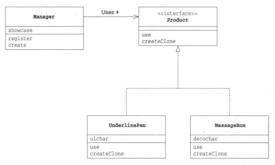
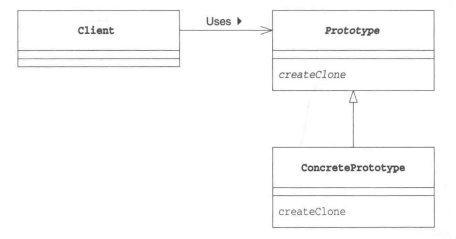

# Prototype 模式

### 定义
- 不是通过new根据类来生成实例
- 根据实例原型、实例模型生成新实例

### 类图

### 角色

### 实现
- framework包：Product类、Manager类
- 无名包：MessageBox类、UnderlinePen类

### 说明
- 对象种类多，无法将他们整合到一个类中时
- 难以根据类生成实例时
- 需要解耦框架与生成的实例时

### 相关的设计模式
- Flyweight模式
- Memento模式
- Composite模式
- Decorator模式
- Command模式